# LLM Cost Observatory

Track and explain LLM spend by feature, model, provider, and workflow.

## MVP scope
- Parse JSONL/CSV usage logs
- Normalize records into a canonical event schema
- Generate spend reports by day/week and dimensions
- Flag anomalies (spikes, retry-heavy paths)
- Export terminal, CSV, and JSON reports

## Quick start
```bash
npm test
node src/cli.mjs ingest ./examples/sample-usage.jsonl
node src/cli.mjs report --group-by feature --window 7d
node src/cli.mjs anomalies --window 7d --threshold 2
```

## Commands
- `ingest <path> [--store <path>] [--strict]`
- `report [--group-by feature|model|provider|endpoint|status] [--window 7d] [--format table|json|csv] [--output <path>]`
- `anomalies [--window 7d] [--threshold 2] [--min-daily-cost 0] [--format table|json|csv] [--output <path>]`
- `export --type report|anomalies --format json|csv --output <path>`

## Schema
See `schemas/usage-event.schema.json`.

Required fields:
- `timestamp`
- `provider`
- `model`
- `feature`
- `request_id`
- `total_tokens`
- `cost_usd`
- `status`

## Start collecting data
Most teams should start by wrapping their OpenAI/Anthropic API client and logging one JSON event per call.

- Guide: `docs/data-collection.md`
- One-line wrapper: `examples/wrappers/with-cost-tracking.mjs`
- Full example: `examples/wrappers/openai-wrapper-example.mjs`

Example:
```js
const openai = withCostTracking(new OpenAI(), { feature: "summarization" });
```

## How to test

### Quick test with sample data (no API key needed)
```bash
# 1. Run unit tests
npm test

# 2. Ingest sample usage events
node src/cli.mjs ingest ./examples/sample-usage.jsonl

# 3. Generate cost report by feature
node src/cli.mjs report --group-by feature --window 7d

# 4. Detect anomalies (spikes, retry-heavy paths)
node src/cli.mjs anomalies --window 7d --threshold 2

# 5. Export as CSV and JSON
node src/cli.mjs export --type report --format csv --output ./examples/report-by-feature.csv
node src/cli.mjs export --type anomalies --format json --output ./examples/anomalies.json
```

### Full E2E with OpenAI (requires API key)
```bash
# 1. Set API key
export OPENAI_API_KEY=your_key

# 2. Collect events with wrapper
node examples/wrappers/openai-wrapper-example.mjs

# 3. Ingest events into local store
node src/cli.mjs ingest ./examples/usage-events.jsonl

# 4. Generate cost report
node src/cli.mjs report --group-by feature --window 7d

# 5. Detect anomalies
node src/cli.mjs anomalies --window 7d --threshold 2 --min-daily-cost 0.01

# 6. Export artifacts for team review
node src/cli.mjs export --type report --format csv --output ./report-by-feature.csv
node src/cli.mjs export --type anomalies --format json --output ./anomalies.json
```

Data flows:
- Wrapper logs → `examples/usage-events.jsonl` (or your custom path)
- Ingest → `.lco/events.jsonl` (local normalized store)
- Reports → Terminal, CSV, or JSON output

## E2E usage
- Full walkthrough: `docs/e2e-walkthrough.md`

## End-to-end flow

```mermaid
flowchart LR
  A[App Feature Call] --> B[Tracked API Wrapper]
  B --> C[LLM Provider API]
  C --> D[Usage + Latency + Status]
  D --> E[JSONL Event Log]
  E --> F[llm-cost-observatory ingest]
  F --> G[Normalized Events Store]
  G --> H[report / anomalies]
  H --> I[Terminal + CSV/JSON Outputs]
  I --> J[Weekly Cost Review and Optimization]
```

