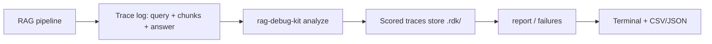

# RAG Debug Kit

Score RAG retrieval traces and surface why answers go wrong - bad retrieval,
ungrounded generation, or weak similarity.

## MVP scope
- Ingest retrieval traces (query, retrieved chunks, answer, optional labels) as JSONL/JSON
- Score each trace: hit@k, MRR, precision@k, recall@k, groundedness, answer F1
- Flag failure modes: `empty_retrieval`, `no_hit`, `ungrounded`, `low_score`
- Aggregate by feature or failure type
- Export terminal, JSON, and CSV reports

## Quick start
```bash
npm test
node src/cli.mjs analyze ./examples/sample-traces.jsonl
node src/cli.mjs report --group-by feature
node src/cli.mjs report --group-by failure
node src/cli.mjs failures --type ungrounded
```

## Commands
- `analyze <path> [--store <path>] [--k 5] [--grounded-threshold 0.2] [--low-score-threshold 0.3] [--strict]`
- `report [--group-by feature|failure] [--format table|json|csv] [--output <path>] [--store <path>]`
- `failures [--type empty_retrieval|no_hit|ungrounded|low_score] [--format table|json|csv] [--output <path>] [--store <path>]`
- `export --type report|failures [--format json|csv] [--output <path>]`

## Schema
See `schemas/rag-trace.schema.json`.

Required fields:
- `timestamp`
- `query_id`
- `query`
- `retrieved` (array of `{ chunk_id, text, score?, is_relevant? }`)
- `answer`

Optional: `feature`, `expected_answer`, `expected_chunk_ids`, `latency_ms`, `metadata`.

Relevance labels come from either `is_relevant` on a chunk or `expected_chunk_ids`
on the trace. With no labels, retrieval metrics (`hit_rate`, `recall_at_k`) are
reported as `null` and only groundedness/latency/failure heuristics apply.

## How it scores
- `hit@k` / `mrr` / `precision@k` / `recall@k`: computed over the top `k` retrieved chunks vs. relevance labels.
- `grounded`: token overlap between the answer and retrieved context; below `--grounded-threshold` the trace is flagged `ungrounded`.
- `low_score`: top retrieval score below `--low-score-threshold`.
- `answer_f1`: token F1 against `expected_answer` when provided.

## Data flow

